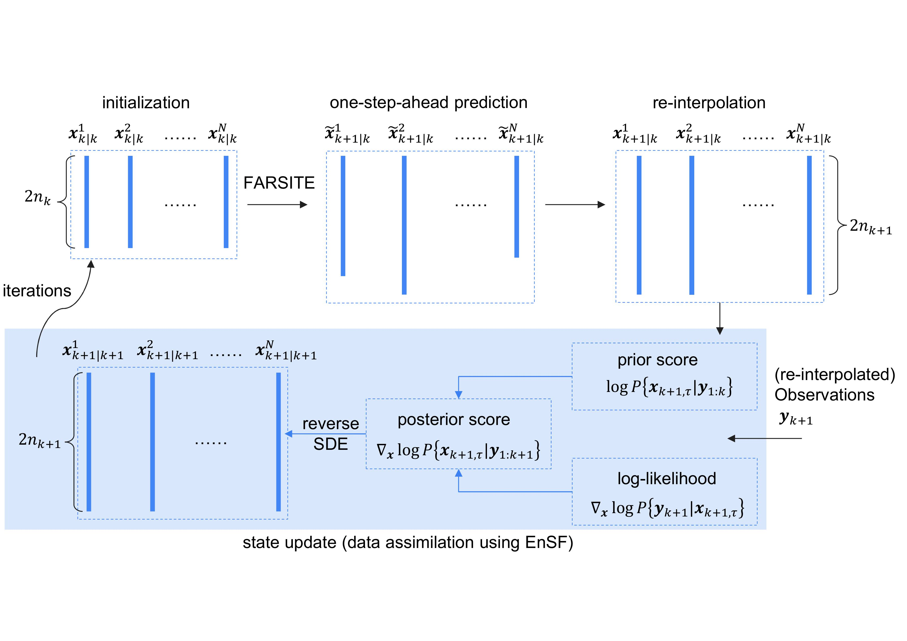

# Fire-EnSF: Wildfire Spread Data Assimilation using Ensemble Score Filter
 
This repository contains the code and data for **Fire-EnSF**, a data assimilation framework that couples the **FARSITE** fire behavior model with the **Ensemble Score Filter (EnSF)** to forecast wildfire spread.
 
## Method Overview
 


The diagram above illustrates the overall Fire-EnSF pipeline: fire boundary observations and landscape/weather inputs drive FARSITE's forward fire-spread prediction, whose ensemble output is corrected at each observation period by the EnSF (data assimilation step) before being fed back into the next forecast cycle.

## Repository and Dataset Access
 
- **Code:** [github.com/Song-Platelet/Fire-EnSF](https://github.com/Song-Platelet/Fire-EnSF)
- **Fire boundary dataset:** [A Dataset of California Wildfire Spread Derived Using VIIRS Observations and an Object-based Tracking System](https://springernature.figshare.com/collections/A_Dataset_of_California_Wildfire_Spread_Derived_Using_VIIRS_Observations_and_an_Object-based_Tracking_System/5601537/1)
  Download `Largefire.tar.gz` and extract `LargeFires_2012-2020.gpkg`, which contains the fire boundary information.
## FARSITE Integration
 
This project uses the C/C++ version of FARSITE. FARSITE is integrated with the EnKF and EnSF frameworks by calling the compiled executable from Python via the `subprocess` module.
 
### Installation and Setup
 
1. Download FARSITE from GitHub.
   - **Linux:** run `farsite_import.py` to fetch FARSITE. Then run the following code:
```bash
   cd src
   make
   ./TestFARSITE
```
   - **Windows:** use the version in the `src` folder, which replaces Linux-specific functions with Windows-compatible alternatives (the makefile has been updated accordingly). Prediction results show no significant difference between the Linux and Windows versions.
2. **Windows compilation:** install the MinGW toolkit ([tutorial](https://www.youtube.com/watch?v=oC69vlWofJQ)). After loading all C/C++ files, run:
```bash
   mingw32-make all
```
   to produce `TestFARSITE.exe`.
 
> **Tip:** 
> 1. FARSITE's primary purpose is fire behavior modeling, so boundary forecasting is only one of many outputs it generates. Most of its execution time goes toward writing output files. We recommend disabling all output generation except the forecasted fire boundary to save computation time — this is already implemented in the Windows version included here. 
> 2. Make sure to attach the required files of TestFARSITE when you run the CLI command.
> 3. Since we have successfully forgotten the details of how we revised the Windows version from the Linux version, we can't give direct help about this :)


## Data Processing
 
- `data_process.ipynb` handles data collection and cleaning. Processed data is provided on GitHub, but many additional fires in the source dataset remain unexplored and are available for further experimentation.
- This code was developed in **March 2025**. The `landfire` Python module can be installed and imported, but current data requests return JSON errors. Two workarounds:
  1. Request data directly from [LANDFIRE](https://landfire.gov/) (delivered via email), or
  2. Build custom landscape files manually, with all required layers as described in the landscape-layer table in the paper.
- **Weather data** comes from [Google Earth Engine](https://code.earthengine.google.com/register) (NOAA GFS 0.25°). See the [Earth Engine access guide](https://developers.google.com/earth-engine/guides/access) for setup instructions.
### Known Environment Issues
 
| Issue | Platform | Workaround |
|---|---|---|
| `osgeo` fails to install | Linux | Use Windows instead — `data_process.ipynb` was only run successfully on Windows. |
| `fiona` incompatible with latest `GeoPandas` when reading `.shp` files | Linux | Pass `engine='pyogrio'` to `geopandas.read_file()`. |
> We recommend preparing two environments. One is for preprocessing, such as collecting the data; the other is for running the model.

## Code Structure
 
- **`util.py`** — shared utility functions (e.g., RMSE computation, FARSITE execution wrapper).
- **Fire ID folders** (four-digit names) — each contains the landscape file and its projection file for that fire. The output of `farsite_run.py`, `farsite_enkf.py`, and `farsite_ensf.py` will be stored here too. 
- **Period folders** — named by assimilation period, where `0` is the starting point for FARSITE. Each contains:
  - `fire_boundary*` — shapefiles (and associated sidecar files) of the fire boundary at that period.
  - `para.input` — the FARSITE input file generated by `data_process.ipynb`.

 
## Simulation Scripts (Synthetic Dynamic System)
 
- **`sim_fine_tune.ipynb`** — simulates the simple dynamic system used for coarse- and fine-tuning experiments.
- **`sim_run.py`** — runs the same dynamic system with data assimilation (EnSF and EnKF), comparing the two. Outputs:
  - `num_com.pdf` — RMSE comparison plot between fine-tuned EnSF and EnKF.
  - `time_com_result.txt` — descriptive statistics on runtime, computed over `trials` iterations of each method.
## Application Scripts (FARSITE Wildfire Runs)
 
- **`farsite_run.py`** — runs FARSITE **without** data assimilation. For each period `i`, the input boundary is the previous period's estimate (period 0 uses the observation directly, so RMSE starts at 0). The run instructions are saved as `run.txt` in each period folder. FARSITE writes hourly boundary forecasts to `output_Perimeters.shp` in the `out` folder; only the final 12-hour estimate is needed, saved separately as `output.shp`.
- **`farsite_ensf.py`** / **`farsite_enkf.py`** — run FARSITE **with** EnSF and EnKF, respectively.
  - Both create an `ensemble` folder per period, containing one subfolder per ensemble member.
  - FARSITE is run in parallel across ensemble members for efficiency.
  - Per-period state estimates are saved as `ensf_{i}.npy` / `enkf_{i}.npy`.
  - EnSF additionally requires hyperparameter tuning, logged to `ensf_final_rmse.db` (SQLite), with columns for fire ID, the two tuning hyperparameters, and average RMSE.
## Data Visualization
 
- **`farsite_ensf.py`** also generates:
  - Dimension-change plots
  - Application fine-tuning plots
  - Fire perimeter comparison plots
  Fine-tuning and perimeter plots are fire-specific and saved under their corresponding fire ID folders.
- **`resamp_effect.py`** — tests how the re-interpolation algorithm affects FARSITE's shape growth, using the Sørensen–Dice Coefficient (SDC) on covered area:
  
 $$SDC = 2 \frac{A_{or}}{(A_o \times A_r)}$$
 
  where $A_o$ and $A_r$ are the areas covered by the original and re-interpolated polygons, and $A_{or}$ is the area of their intersection.

- **`uq_plt.ipynb`** — visualizes:
  - Sensitivity analysis of filter performance across the $ε_α$ and $ε_β$ parameters on the EnSF-generated ensemble.
  - Uncertainty quantification and ensemble behavior of Fire-EnSF vs. FARSITE-with-EnKF for total fire area (km²) across multiple fire IDs and observation periods.
- **`scd_plt.py`** — generates the comparison of observed vs. estimated Sørensen–Dice Coefficients on total burned area, across multiple filtering times and methods.
## Additional Resource
- [A high spatial resolution daily fire perimeter progression](https://data.mendeley.com/datasets/95rj5d379g/1): can be directly downloaded.
- [Country-level fire perimeter datasets (2001–2021)](https://github.com/earthlab/firedpy): The fire perimeter in on the README.md.


## Citation
 
If you find this work helpful, please cite:
 
```bibtex
@article{shi2025fire,
  title={Fire-EnSF: Wildfire Spread Data Assimilation using Ensemble Score Filter},
  author={Shi, Hong Zheng and Wang, Yuhang and Liu, Xiao},
  journal={arXiv preprint arXiv:2510.15954},
  year={2025}
}
```
